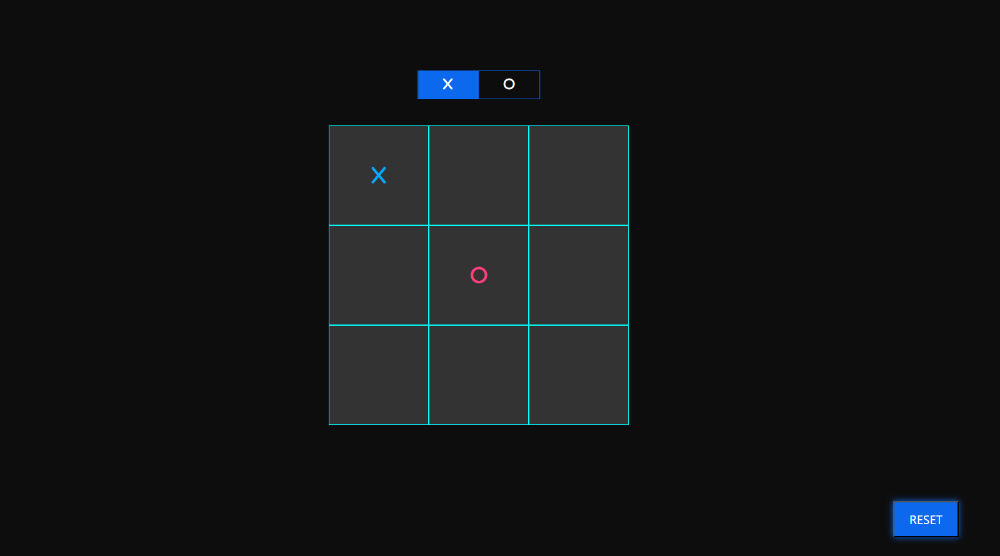

# Tic-Tac-Toe (X-O) Game

A responsive X-O game built with HTML, SCSS, and Vanilla JavaScript. The game allows two players to compete locally with automatic winner detection, turn switching, and board reset functionality.

## ✨ Features

- 🎮 Two-player gameplay
- 🔄 Automatic turn switching (X / O)
- 🏆 Winner detection based on all possible winning combinations
- 🎯 Winning cells are highlighted
- 🤝 Draw detection when no winner exists
- 🔁 Reset button to start a new game
- 📱 Responsive layout

## 🛠️ Technologies Used

- HTML5
- SCSS (CSS)
- Vanilla JavaScript (ES6)
- Bootstrap
- Font Awesome

## 📂 Project Structure

```
├── index.html
├── js
│   ├── main.js
    └── bootstrap.min.js
├── scss
│   ├── main.scss
│   ├── bootstrap.min.css
│   └── all.min.css
```

## 🎮 How to Play

1. Player **X** starts the game.
2. Players take turns selecting an empty square.
3. The game automatically checks for a winning combination after every move.
4. The winning row, column, or diagonal is highlighted.
5. If all squares are filled without a winner, the game ends in a draw.
6. Press **Reset** to start a new match.

## 📸 Screenshots




## 👨‍💻 Author

**Mohamed Hamdy**

GitHub: https://github.com/Mo0Hamdy